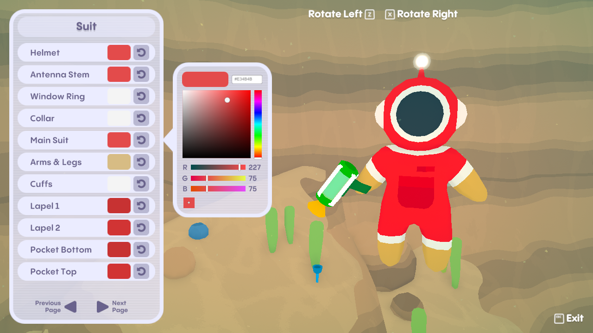
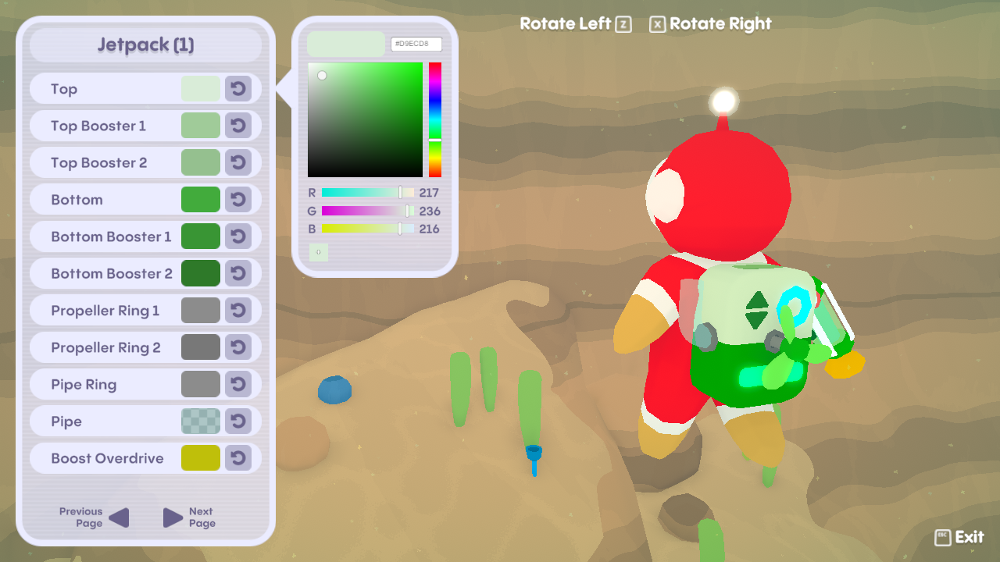
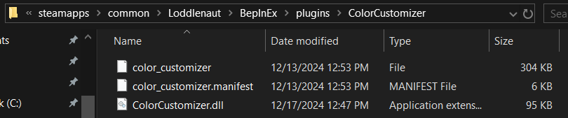

# Loddlenaut Color Customizer
A BepInEx/HarmonyX mod for [Loddlenaut](https://www.loddlenaut.com/) to change the colors of the Loddlenaut (plus other stuff eventually). Features detailed control over every color and an in-game UI with a color picker, including individual color sliders and a color swatch feature.

# Installation
First, download and install BepInEx 5 from [here](https://github.com/BepInEx/BepInEx/releases/tag/v5.4.23.2). You will need the file called `
BepInEx_win_x64_5.4.23.2.zip` (the 64bit version). Installation instructions can be found [here](https://docs.bepinex.dev/articles/user_guide/installation/index.html). This is essentially the mod loader and programming framework this mod needs to function.

Next, download the latest release of this mod from the [releases](https://github.com/paperman5/LoddlenautColorCustomizer/releases) page and unzip it into the directory where your Loddlenaut game executable lives. If you have the game on Steam, you can easily find this location by right-clicking the game in the game list and selecting `Manage > Browse Local Files`. After doing so, you should have 3 files in the `plugins` sub-directory under the `BepInEx` directory like so.

# Usage
To open the UI, open the player's inventory (Q by default) and then press the color menu open key (C by default, re-bindable in the mod's config file). You can rotate the Loddlenaut by pressing the rotate keys (Z and X by default, also re-bindable). To change a color, click on the color you want to change to open a color picker, or press the reset button next to the color to reset it to the default. Pages for the colors of the various equipment/upgrades will only appear after you have gotten that equipment or upgrade in-game.

# Limitations
This mod is currently in alpha and there are several things that currently don't work. Some of these are planned to be added or fixed in the future - see the Planned Features section.

- The UI is currently only controllable with keyboard & mouse.
- The only colors that can currently be changed are those on the Loddlenaut and the Bubble Gun. The ship colors can be changed through the mod's config file but the UI has not been implemented yet.
- Some colors can't currently be seen while changing them in the UI (bottom of jetpack, Bubble Gun blaster tip popout, etc)
- Certain minor colors such as particle effect colors cannot currently be changed.
- In general, colors may appear differently between UI and the in-game model. This is because the game uses post-process color grading to adjust the colors after the frame is rendered. Different areas of the game have different color grading settings, so the colors from the UI will look different in each of these areas in-game.
- Certain colors that have a glow/bloom effect can be counterintuitive to change and may appear significantly different between the UI and in-game. The game uses HDR colors internally for the glow effect, meaning the color selected from the UI is multiplied by anywhere from 2-16x before being shown in-game.

# Planned Features
- Controller support for the color change UI.
- Full color changing support for the Loddlenaut, all the Loddlenaut's equipment (Bubble Gun, Scrap Vac, Puddle Scrubber + upgrades for each), and the ship.
- Extra camera angles to be able to see each color while adjusting it.